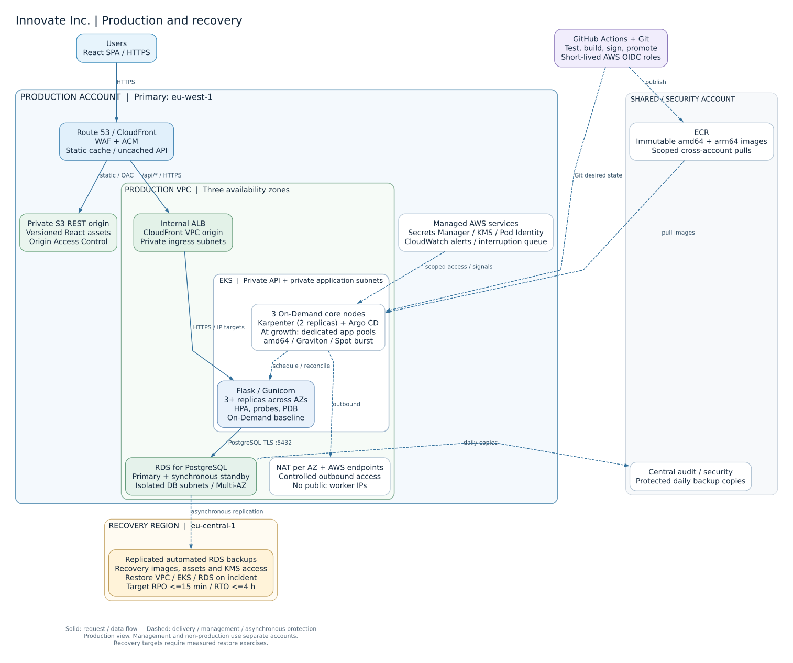

# Innovate Inc. — AWS architecture

**Design date: 14 September 2026.** Serve React through CloudFront/private S3, run Flask on Amazon EKS, and store PostgreSQL data in Amazon RDS. Four AWS accounts separate ownership and access; production spans three availability zones within the primary Region.

## Decisions at a glance

| Area | Decision |
| --- | --- |
| Cloud | AWS; reuse the assessment's EKS expertise and Terraform modules |
| Accounts | Management, shared/security, non-production, production |
| Geography | Primary `eu-west-1`, three production AZs; recovery in `eu-central-1` |
| Ingress | CloudFront + WAF; private S3 for React, internal ALB for `/api/*` |
| Compute | EKS; platform-only Graviton system nodes; separate On-Demand API pools and Spot burst/job pools |
| Database | RDS PostgreSQL Multi-AZ DB instance with one standby |
| Regional recovery | Replicated backups; target RPO <=15 minutes / RTO <=4 hours, verified by drills |
| Launch budget | Approximately **$1,200–1,300/month** for production + non-production before traffic; [assumptions below](#launch-cost-estimate) |

The [Terraform POC](../terraform/README.md) implements the cluster/autoscaling part. This document proposes the complete production platform.

## Why AWS

AWS and GCP can both support this application. I recommend AWS because it lets the team reuse the assessment's EKS/Karpenter implementation and operating knowledge, while RDS, CloudFront and AWS Organizations cover the database, delivery and account-isolation requirements. This is an operational-fit decision, not a claim that AWS is universally cheaper. If Innovate already had a GCP platform or stronger GCP skills, [GKE Autopilot](https://docs.cloud.google.com/kubernetes-engine/docs/concepts/autopilot-overview) and Cloud SQL would merit evaluation; neither prior investment is assumed here.

## Assumptions and service targets

Assume an EU user base, `eu-west-1` as the primary Region, and `eu-central-1` as an allowed recovery Region. Confirm customer location, data residency, budget, existing identity provider and support ownership before implementation. User count alone does not determine capacity: measure peak requests/second, request cost, response sizes, concurrent sessions, database size and growth.

Proposed launch targets are **99.9% monthly availability** for essential API journeys and **p95 API latency below 300 ms** at agreed peak load. Validate these and the recovery targets through load/failure tests. Assume stateless API replicas, no required WebSockets/gRPC, and sensitive data stored in PostgreSQL rather than pod-local files.

## High-level diagram (HLD)

[Editable diagram source](diagrams/innovate.dot). Solid arrows show request/data paths; dashed arrows show delivery, management or asynchronous protection. The production VPC spans three AZs. Managed services are outside the VPC except their private interfaces/resources. The diagram expands production; non-production uses a separate account, VPC, cluster and database.

## Cloud environment structure

Start with the four-account structure recommended in Opsfleet's [Setting Up Your First AWS Organization](https://www.opsfleet.com/blog-posts/setting-up-your-first-aws-organization):

| Account | Purpose and access |
| --- | --- |
| Management | AWS Organizations, consolidated billing and IAM Identity Center. Organization administrators only; no application workloads. |
| Shared infrastructure / security | ECR, parent DNS zone, central audit logs, security tooling and protected backup copies. Restricted platform/security access. |
| Non-production | Development, staging and disposable test namespaces in one EKS cluster; separate non-production PostgreSQL. Developers can deploy here. |
| Production | Customer-facing services, production EKS/RDS/S3/CloudFront and narrowly scoped deployment roles. Routine developer access is read-only. |

This gives a small team separate production permissions, quotas and billing attribution without a shared network dependency between environments. Manage the landing zone through Terraform and AWS Organizations; this proposal does not assume an AWS Control Tower landing zone with additional mandatory accounts. As regulatory requirements or team size increase, separate log archive, security tooling and shared build infrastructure into their own accounts.

Use IAM Identity Center with MFA and short-lived role sessions. Keep an audited emergency role. Apply SCPs to member accounts to restrict unapproved Regions (with explicit exceptions for global services), protect audit configuration and restrict leaving the organization. SCPs set permission ceilings; IAM must still grant access, and management-account permissions require separate controls. Use account-level budgets and tags such as `Environment`, `Service`, `Owner` and `CostCenter`.

Delegate application DNS subzones to workload accounts. Grant ECR pulls explicitly to production/non-production node roles with corresponding repository policies; CI alone publishes approved artifacts. Central logs use a dedicated bucket policy, encryption, versioning and retention protection. Shared ECR or logging access does not imply network peering or access to production data. Do not copy real customer data to development; use synthetic or irreversibly sanitized fixtures.

## Network design

Use independent IPv4 VPCs: production `10.50.0.0/16`, non-production `10.60.0.0/16`, recovery `10.70.0.0/16`. Reserve non-overlapping space for growth. Production subnet allocation is:

| Tier | AZ A / AZ B / AZ C | Routing and resources |
| --- | --- | --- |
| Public egress | `10.50.192.0/24`, `.193.0/24`, `.194.0/24` | Default route to internet gateway; one NAT gateway per AZ |
| Private application | `10.50.0.0/20`, `.16.0/20`, `.32.0/20` | EKS nodes/pods; each subnet uses its local AZ's NAT for external egress |
| Private ingress | `10.50.200.0/24`, `.201.0/24`, `.202.0/24` | Internal ALB and CloudFront VPC-origin interfaces |
| Isolated database | `10.50.208.0/24`, `.209.0/24`, `.210.0/24` | RDS subnet group; no internet/NAT default route |
| Control-plane interfaces | `10.50.216.0/27`, `.217.0/27`, `.218.0/27` | EKS private endpoint interfaces; reserved IP headroom |

The abbreviated CIDRs retain the `10.50` prefix. The managed EKS control plane runs in AWS-managed infrastructure and connects through these interfaces. EKS API access is **private only** in production. Operators and Terraform use short-lived VPC runners accessed through audited Systems Manager sessions; runner security groups allow the private API connection. Each environment has separate runner roles and no route to the other's VPC. Workers and runners have no public IPs or inbound SSH access.

Enable VPC DNS and an S3 gateway endpoint in each VPC. Production also gets ECR API/DKR, Secrets Manager and EKS Auth interface endpoints in three AZs; non-production initially uses NAT for those services. Give endpoint security groups inbound 443 only from required workloads/nodes. Add other endpoints when traffic or policy justifies their hourly cost. Retain NAT for external dependencies and controller APIs. Enable flow logs with retention and alerting.

### Request path and network enforcement

1. Route 53 resolves the application hostname to CloudFront. AWS WAF managed rules and rate limits protect the distribution; deploy rule changes in count mode first. ACM supplies TLS certificates (CloudFront's certificate in `us-east-1`; the ALB certificate in the application Region).
2. CloudFront's default behavior serves the React build from a private **S3 REST origin**, using Origin Access Control and S3 Block Public Access. Fingerprinted assets have long cache lifetimes; `index.html` has a short lifetime. A viewer-request rewrite handles SPA routes on the static behavior only. Do not rewrite `/api/*` failures into successful HTML responses.
3. `/api/*` uses an **internal ALB through CloudFront VPC origins**. Disable caching for authenticated API responses; forward required headers including `Authorization`, cookies and query strings, and allow the API's HTTP methods. Use HTTPS to the ALB and ensure the forwarded/origin hostname matches its certificate. This keeps the SPA and API on one browser origin. [AWS documents private ALB VPC origins and their prerequisites](https://docs.aws.amazon.com/AmazonCloudFront/latest/DeveloperGuide/private-content-vpc-origins.html), including an attached internet gateway even though origin traffic does not traverse it.
4. The AWS Load Balancer Controller manages the internal ALB and IP targets for ready Flask pods. Restrict ALB inbound 443 to CloudFront's service-managed VPC-origin security group after origin bootstrap. Admit target traffic only from the ALB security group. Use HTTPS target groups and automate backend certificate delivery/rotation; ALB encrypts this hop but does not validate target certificates, so security groups remain part of the trust boundary. See [ALB target-group TLS behavior](https://docs.aws.amazon.com/elasticloadbalancing/latest/application/load-balancer-target-groups.html).
5. PostgreSQL accepts 5432 from the approved application-node security group, with default-deny pod egress allowing only the API's database access. Platform namespaces and workload admission/RBAC are trusted boundaries; node security groups alone cannot distinguish colocated pods. Add security groups for pods when independent workload identities require stronger network separation. Require TLS with CA/hostname validation (`sslmode=verify-full`) at the client and enforce SSL on RDS.

Enable the VPC CNI network-policy capability explicitly; simply creating NetworkPolicy objects is insufficient. Apply default-deny ingress/egress in application namespaces, then allow ALB target traffic, DNS, required AWS credential/service endpoints and database access. Test policies on both architectures and during pod startup, including probes and Pod Identity connectivity. Use matching Service/target ports where required by the selected CNI version. AWS describes the [supported configurations and limitations](https://docs.aws.amazon.com/eks/latest/userguide/cni-network-policy.html). Security groups handle VPC resource boundaries; pod policies handle permitted application flows. Keep NACLs simple and validate return traffic.

### Sensitive data and identity

Use Cognito with authorization-code/PKCE flows for the SPA, or integrate the client's established OIDC provider. The API validates token issuer, audience, signature and expiry, then enforces authorization and tenant/record ownership on every sensitive operation. WAF and network isolation do not provide application authorization. Apply CSRF protection if cookies authenticate requests, a restrictive Content Security Policy, input validation and safe error responses. React build-time variables are public; never put secrets in them.

Use Secrets Manager for database credentials, scoped to the API's service account through EKS Pod Identity and a scoped secret-delivery mechanism. Automate rotation and application reload/reconnect; do not pass secret values through Git or Terraform outputs. Use distinct least-privilege database roles for API access and migrations. Encrypt RDS, snapshots, EBS, S3 and central logs; manage recovery-region KMS keys and grants as part of the recovery configuration. Retain only necessary user data, redact tokens/PII from logs and audit privileged access. Confirm retention and deletion requirements with the client.

## Compute, resource allocation and scaling

Use one production EKS cluster and one non-production cluster with the same Terraform modules and versioned add-ons. Start on a tested EKS standard-support version and schedule regular upgrades in non-production first. The assessment POC pins the latest listed EKS version, 1.36; production adoption also requires add-on and application qualification.

Keep platform and application capacity separate from launch:

| Capacity | Initial production allocation | Placement |
| --- | --- | --- |
| System | Three On-Demand `m7g.large` nodes, one per AZ through managed node groups | Tainted for platform services only: Karpenter, DNS, metrics-server, Argo CD and controllers |
| API | Karpenter On-Demand NodePools; budget for three `c7g.large`-sized nodes across AZs | Three or more Flask replicas; hard On-Demand requirement, ARM preference with tested x86 fallback |
| Burst / jobs | Separate diversified Spot NodePools; no idle minimum | Restartable jobs and, after testing, an optional API burst Deployment |

Run two Karpenter replicas on separate system nodes. Use broad c/m/r families and both CPU architectures in application pools; the instance types above are sizing/cost examples, not single-type restrictions. Non-production starts with two system nodes, one application node and reduced replica counts.

[EKS Auto Mode](https://docs.aws.amazon.com/eks/latest/userguide/automode.html) reduces node and infrastructure-controller maintenance and also supports [custom NodePools, Graviton and Spot](https://docs.aws.amazon.com/eks/latest/userguide/create-node-pool.html). This design retains self-managed Karpenter to reuse the assessment implementation, control controller/CRD upgrades and avoid the [additional Auto Mode node charge](https://aws.amazon.com/eks/pricing/); the team must own that maintenance, and Auto Mode is a sensible alternative if that operational burden outweighs the charge.

Start the Flask Deployment with three replicas, one per AZ using topology-spread constraints plus hostname anti-affinity. Give each replica an initial request of 250m CPU / 512 MiB memory and a 768 MiB memory limit, then tune from load tests; avoid a restrictive CPU limit that introduces unnecessary throttling. Run Gunicorn with a measured worker count, never Flask's development server. Use startup/readiness/liveness probes, graceful SIGTERM handling and sufficient termination time. Readiness reflects whether a pod can serve; liveness should not restart every pod during a database outage. Use a PDB such as `maxUnavailable: 1` and rolling updates with `maxUnavailable: 0`, `maxSurge: 1`, with enough spare capacity for the surge.

Enable HPA via metrics-server, initially 3–12 replicas with a starting CPU target of 60% and a scale-down stabilization window. Requests determine both HPA utilization and Karpenter's capacity calculations. Pending API pods trigger additional On-Demand nodes; application pods have no system-node toleration. Test scaling, rolling updates and an AZ loss with enough headroom for replacement replicas.

Karpenter creates nodes for unschedulable pods and consolidates spare capacity. Define separate `arm64` and `amd64` pools with broad c/m/r instance families and multiple AZs. Prefer ARM for compatible images; retain x86 for dependencies that need it. Use Spot for restartable jobs and, after interruption testing, a separate API burst Deployment behind the same Service. Burst capacity may allow On-Demand fallback; the minimum On-Demand API baseline remains independently sized. Keep checkpointed jobs/idempotent requests, interruption events via EventBridge/SQS, conservative disruption budgets and tested draining. PDBs cannot stop an EC2 Spot interruption. [Karpenter's NodePool](https://karpenter.sh/docs/concepts/nodepools/) and [disruption documentation](https://karpenter.sh/docs/concepts/disruption/) define these controls.

Use Namespace ResourceQuotas and LimitRanges, bounded HPA maxima, NodePool CPU/memory limits and cost alerts together. NodePool limits are not an exact billing cap. Monitor IP/ENI and EC2 quotas before scale-out; enable/test CNI prefix delegation when density requires it. Do not run Cluster Autoscaler and Karpenter against the same capacity. System/core managed groups have explicit Terraform-owned sizing.

### Containerization and CI/CD

Build Python images using multi-stage Dockerfiles, pinned base-image digests and locked dependencies. Run as non-root, drop Linux capabilities, use a read-only filesystem with explicit writable mounts, and enforce restricted Pod Security. Build and test `linux/amd64` and `linux/arm64` artifacts with Buildx; use native runners for architecture-sensitive integration/performance tests. Publish one immutable OCI index to ECR. Scan dependencies/images, generate an SBOM and sign the artifact; reject disallowed vulnerabilities or untrusted artifacts according to an agreed policy. Deploy by digest.

Use GitHub Actions for tests/builds with AWS OIDC roles constrained to the intended repository/ref/environment. Avoid static AWS keys and do not expose trusted build credentials to untrusted pull-request code. Build once, test in non-production, then promote the **same digest** through a reviewed configuration change. Argo CD in each cluster reconciles its authorized Git path and Helm values; production credentials are not shared with non-production. GitOps agents reach Git/ECR outbound, so CI does not need a public Kubernetes API. Bootstrap Argo CD and cloud resources through a private Terraform runner with approved plans and separate state per environment/component.

Deliver the SPA build to versioned S3 assets and update the entry point only after its assets exist. Keep the previous entry point/assets for rollback. For the API, run a single controlled migration Job with advisory locking, separate credentials and expand/contract schema changes before rollout. Roll back application digests through Git; database rollback requires a migration/recovery plan and cannot be assumed safe. Alert on failed reconciliation or rollout, then smoke-test real user journeys.

This uses the module, review and drift-management practices discussed in Opsfleet's [Infrastructure as Code: How to Implement Best Practices](https://www.opsfleet.com/blog-posts/infrastructure-as-code-how-to-implement-best-practices). Start with ordinary Terraform and the existing CI engine; add orchestration wrappers only when environment complexity justifies them.

## PostgreSQL, availability and recovery

Choose **RDS for PostgreSQL with a Multi-AZ DB instance deployment**: one primary and one synchronous standby in another AZ. The third subnet provides placement flexibility; this is not a three-writer database. RDS operates backups, patching and failover while the team owns schema design, queries, capacity and recovery testing. The standby does not serve reads. This choice follows the managed-service preference in Opsfleet's [Running Database Services on Kubernetes](https://www.opsfleet.com/blog-posts/running-database-services-on-kubernetes) and AWS's [Multi-AZ DB instance model](https://docs.aws.amazon.com/AmazonRDS/latest/UserGuide/Concepts.MultiAZSingleStandby.html).

Start with a modest Graviton-compatible RDS instance and gp3 storage, sized by memory/connection needs and load tests. Burstable instances can suit the initial load if CPU credits are monitored; move to a sustained-performance class before sustained traffic exhausts them. Pin a supported PostgreSQL major version compatible with the application; test patches and major upgrades in staging, and enable deletion protection with a final snapshot on intentional retirement. Non-production can use a smaller Single-AZ instance and synthetic data.

Bound each Gunicorn worker's SQLAlchemy connection pool and overflow. Calculate `maximum replicas × workers × (pool size + overflow)` plus migration/admin connections, keeping explicit headroom below the database limit. For example, 12 pods × 2 workers × 3 connections = 72 application connections; verify the selected DB instance supports that plus reserve. Add RDS Proxy when connection churn or larger replica counts justify its cost; load-test transaction behavior and session pinning. Use retry/backoff, connection recycling and short DNS caching so clients recover after failover. Avoid retrying non-idempotent operations blindly.

Enable encrypted automated backups with **14-day retention and PITR**, alert on backup failures and monitor `LatestRestorableTime`. Separately replicate automated backups to `eu-central-1` in the production account for regional recovery, retaining seven days there. Multi-AZ DB **instance** deployments support this replication; support differs for Multi-AZ DB clusters. See [RDS backups](https://docs.aws.amazon.com/AmazonRDS/latest/UserGuide/USER_WorkingWithAutomatedBackups.html) and [cross-Region automated backup replication](https://docs.aws.amazon.com/AmazonRDS/latest/UserGuide/USER_ReplicateBackups.html).

Use AWS Backup to copy daily snapshots to the shared/security account, initially retaining 30 days. Configure the organization, destination vault policy and customer-managed KMS permissions for [cross-account backup copies](https://docs.aws.amazon.com/aws-backup/latest/devguide/create-cross-account-backup.html), then test a restore using recovery-account credentials. Enable [Vault Lock](https://docs.aws.amazon.com/aws-backup/latest/devguide/vault-lock.html) in governance mode with lock-removal permissions restricted to the security emergency role; use compliance mode if the agreed retention requirements demand an irreversible lock. A compromised production role must not be able to delete these copies or disable the destination key.

| Failure | Mechanism | Proposed RPO / RTO |
| --- | --- | --- |
| Pod or worker loss | Multiple replicas, probes, scheduling and node replacement | No durable data loss / API remains available if remaining capacity is sufficient |
| DB instance or AZ failure | RDS synchronous standby and automatic failover; client reconnect/backoff | Near-zero committed-data loss / target under 5 minutes, measured including client recovery |
| Bad migration or accidental deletion | PITR to a new database, integrity checks and endpoint switch | Restore to an agreed pre-error point / target under 2 hours for initial data volume; later valid writes need reconciliation |
| Primary Region outage | Restore replicated automated backup; recreate EKS/app infrastructure and switch traffic | Target <=15-minute RPO / <=4-hour RTO; asynchronous replication and restore time must be measured |
| Production-account compromise | Independently protected daily backup copy, clean recovery roles/account and keys | Target <=24-hour RPO / <=8-hour RTO; depends on copy completion and tested access |

These targets are not AWS guarantees. Multi-AZ addresses local availability; backups address corruption/recovery; asynchronous copies address regional loss. Daily cross-account snapshots do not provide the same PITR window as replicated automated backups. Treat excessive backup lag or a failed copy as a recovery-objective breach.

For regional recovery, keep Terraform, application configuration, compatible images/SPA artifacts, destination KMS keys and backup access available outside the primary Region. Replicate ECR artifacts and required S3 content; deploy recovery-region Secrets Manager configuration/rotation without embedding secrets in Git. Pre-establish quotas and permissions. An incident runbook must: declare the incident and prevent split-brain writes; choose the restore point; restore RDS and verify data; provision the recovery VPC/EKS and reconcile GitOps; update application secrets/endpoints; run smoke/security checks; switch the CloudFront API origin to the recovery VPC origin and static origin if needed; monitor recovery. With one global CloudFront distribution, changing Route 53 alone does not switch its regional origins. Rehearse return to the primary Region separately.

Run monthly isolated restore tests and quarterly AZ/region recovery exercises, recording restore time, usable restore point, application behavior and cleanup. Start with backup-and-restore regional DR to contain costs. If measured objectives become insufficient, add a cross-Region read replica/warm application environment and validate promotion/data-loss behavior before promising a shorter recovery time.

## Operations, cost and growth

Use CloudWatch/ADOT for structured application/platform logs, metrics and traces, with PII redaction, retention and sampling. Monitor API success/latency, saturation, Pending pods, HPA/NodePool limits, Karpenter failures, available subnet IPs, RDS connections/storage/replica health, backup lag and deployment status. Page an identified on-call owner on user-impacting SLO burn and critical recovery failures; put capacity trends and low-priority security findings in a work queue. Keep dashboards, runbooks, ownership and an incident review process alongside code.

### Launch cost estimate

Budget **$1,200–1,300/month** for both environments, using 730 hours, Ireland On-Demand rates, nine always-on EC2 nodes and low ancillary-service usage. Separating application capacity from system nodes is included in this estimate. The count reflects the availability requirement rather than the initial daily user count.

| Component | Monthly USD, rounded |
| --- | ---: |
| Two EKS standard-support control planes | $146 |
| Five `m7g.large` system nodes: three production + two non-production | $332 |
| Four `c7g.large`-sized application nodes: three production + one non-production | $226 |
| PostgreSQL: production Multi-AZ `db.t4g.medium`, dev `db.t4g.micro`, 100/20 GiB gp3 | $141 |
| Four NAT gateways and their public IPv4 addresses | $155 |
| Two internal ALBs, fixed hourly charge | $37 |
| Four production interface endpoints in three AZs | $96 |
| Nine 30-GiB gp3 node volumes | $24 |
| Small logs/metrics, WAF, S3/ECR, DNS, keys/secrets, backups and runner allowance | $40–90 |

Rates were checked on 14 September 2026; [calculations and primary pricing sources](COSTS.md) make the estimate reproducible. It excludes VAT, support plans, material data transfer/request volume, extra I/O and burst compute. Recheck using the [AWS Pricing Calculator](https://calculator.aws/) before provisioning.

Set budgets, anomaly alerts, resource tags and ECR/log lifecycle policies from day one. Schedule unused non-production worker capacity, use its smaller Single-AZ database and one NAT, and buy Savings Plans only after measuring steady usage. EKS control-plane charges continue when worker nodes are stopped. Production keeps per-AZ egress and its On-Demand API baseline.

| Stage / measured trigger | Change |
| --- | --- |
| Launch; low request rate | Static SPA delivery, three API replicas on dedicated On-Demand pools, managed PostgreSQL and operational ownership |
| API saturation | Tune requests/HPA and database pools, add tested Spot burst/worker capacity and raise quotas |
| Slow queries or DB saturation | Fix indexes/queries and pool sizing first; scale RDS vertically, then add read replicas/cache only for suitable access patterns |
| Long-running work | Introduce SQS and independently autoscaled workers, with idempotency, dead-letter handling and suitable Spot checkpoints |
| Millions of users / stronger recovery targets | Load-test actual RPS and working set; consider data partitioning or Aurora after benchmarking; add warm regional recovery when justified |

CloudFront, HPA and Karpenter do not remove database or application bottlenecks. Scale based on measured demand rather than user-count labels. Opsfleet's [From Zero to Kubernetes in Production in 90 Days](https://www.opsfleet.com/blog-posts/from-zero-to-kubernetes-in-production-in-90-days) emphasizes non-production validation, team training and production readiness tests. Apply that approach through developer walkthroughs, load/autoscaling tests, secret rotation, failed-rollout drills and demonstrated restores before launch.

## Relationship to the technical POC

| Area | Runnable assessment POC | Proposed Innovate Inc. production |
| --- | --- | --- |
| Accounts and state | One supplied account; local stage states | Four accounts; encrypted/locked remote state and scoped CI roles |
| API and egress | Public API allowlist plus private endpoint; one NAT by default | Private EKS API, controlled private operator/runner access, NAT per AZ |
| Core capacity | Two Graviton On-Demand system-only nodes | Three system-only Graviton nodes across AZs; API on separate On-Demand pools from launch |
| Workloads | x86/ARM HTTP demos with Spot preference and fallback | Flask API with reliable On-Demand baseline, tested ARM builds and selected Spot workloads |
| Application services | ClusterIP demo Services | CloudFront/WAF, private S3/internal ALB, Cognito, RDS and secret management |
| Operational controls | Basic EKS/flow logs and placement verifier | Enforced network policies, CI/GitOps, SLO alerts, protected backups and exercised DR |

The Opsfleet articles guide the design principles; current AWS/Karpenter documentation supplies version-specific details.
