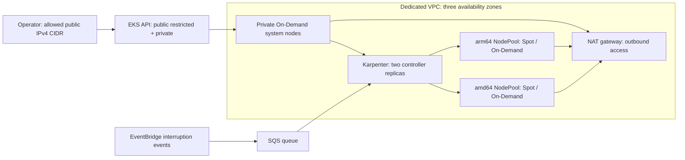

# EKS, Karpenter, Graviton and Spot POC

Terraform deploys a dedicated VPC and an EKS cluster, then installs Karpenter and two workload NodePools: `amd64` (x86) and `arm64` (AWS Graviton). Both prefer Spot and allow On-Demand fallback. Two small On-Demand system nodes host Karpenter and CoreDNS so provisioning does not depend on the nodes Karpenter creates.

This is the runnable technical assessment. The separate [Innovate Inc. design](../architecture/README.md) describes a production environment. See [validation evidence](VALIDATION.md) for the checks actually performed; an AWS deployment is required to establish runtime success.

## What gets created



EKS places network interfaces in dedicated control-plane subnets. Workers have no public IPs. Private workload subnets and only the node security group have Karpenter discovery tags. IAM uses EKS Pod Identity, with separate roles for Karpenter and the VPC CNI, and EKS access entries for the operator and nodes.

| Directory | Responsibility |
| --- | --- |
| `01-cluster/` | VPC, EKS, system nodes, add-ons, IAM, instance profile, interruption queue and rules |
| `02-karpenter/` | Versioned CRD chart followed by the matching Karpenter controller chart |
| `03-nodepools/` | An AL2023 EC2NodeClass and architecture-specific NodePools |
| `examples/` | Restricted, non-root multi-architecture HTTP Deployments and ClusterIP Services |
| `scripts/` | Local validation and post-deployment verification |

Apply these **three independent Terraform roots in order**. The Helm provider needs an existing cluster, and the Kubernetes manifest provider needs the installed CRD schemas during planning. This avoids a first-apply dependency problem without `-target`, sleeps or local-exec provisioners. The POC uses three local state files; stages 2 and 3 read stage 1's outputs.

## Versions

Verified against upstream documentation on **14 September 2026**; pins are in `01-cluster/main.tf` and committed provider lock files.

| Component | Selection |
| --- | --- |
| EKS | **1.36**, the latest EKS minor listed in [AWS's release calendar](https://docs.aws.amazon.com/eks/latest/userguide/kubernetes-versions.html) on the verification date |
| Karpenter controller / CRDs | **1.14.1**; Kubernetes 1.36 requires Karpenter >=1.13 per the [compatibility matrix](https://karpenter.sh/docs/upgrading/compatibility/) |
| Node images | `al2023@v20260903`; system-node release `1.36.3-20260903`, from the [EKS AMI release](https://github.com/awslabs/amazon-eks-ami/releases/tag/v20260903) |
| EKS / VPC modules | `21.25.0` / `6.7.2` |
| Providers | AWS `6.64.0`, Helm `3.3.0`, Kubernetes `2.38.0`; see `.terraform.lock.hcl` in each stage |

Add-ons resolve the latest compatible EKS build at plan time unless `addon_versions` is supplied. Record the resolved versions after a successful deployment and pin them for subsequent environments. Recheck regional version/AMI availability before applying; see [preflight and upgrades](OPERATIONS.md).

## Deploy

Prerequisites: Terraform >=1.10 and <2.0, AWS CLI v2, a compatible `kubectl` (prefer 1.36), Python 3 for the verifier, and AWS credentials for a dedicated assessment account. The operator needs provisioning permissions for EKS, EC2/VPC, IAM including PassRole, KMS, CloudWatch Logs, SQS and EventBridge. Helm is installed through its Terraform provider; the Helm CLI is optional for diagnostics.

The default Region is `eu-west-1`. It must have at least three standard AZs. Allow EC2 On-Demand and Spot vCPU quota for the POC. Check whether the account already has `AWSServiceRoleForEC2Spot`; set `create_spot_service_linked_role = true` only if it is absent. Use a permanent IAM role/user ARN for `cluster_admin_arn`, not an `arn:aws:sts::...:assumed-role/...` session ARN. Use that identity for all stages, including the AWS CLI authentication used by Helm and Kubernetes.

Run from the repository root:

```bash
# Select and authenticate your own assessment profile, if using profiles.
export AWS_PROFILE=assessment
aws sts get-caller-identity
cp terraform/01-cluster/terraform.tfvars.example terraform/01-cluster/terraform.tfvars
# Edit terraform.tfvars: real account ID, operator IAM ARN and your egress /32.

terraform -chdir=terraform/01-cluster init -lockfile=readonly
terraform -chdir=terraform/01-cluster plan -out=cluster.tfplan
terraform -chdir=terraform/01-cluster apply cluster.tfplan

export POC_CLUSTER="$(terraform -chdir=terraform/01-cluster output -raw cluster_name)"
export POC_REGION="$(terraform -chdir=terraform/01-cluster output -raw region)"
aws eks update-kubeconfig --region "$POC_REGION" --name "$POC_CLUSTER" --alias "$POC_CLUSTER"
kubectl --context "$POC_CLUSTER" get nodes

terraform -chdir=terraform/02-karpenter init -lockfile=readonly
terraform -chdir=terraform/02-karpenter plan -out=karpenter.tfplan
terraform -chdir=terraform/02-karpenter apply karpenter.tfplan

terraform -chdir=terraform/03-nodepools init -lockfile=readonly
terraform -chdir=terraform/03-nodepools plan -out=nodepools.tfplan
terraform -chdir=terraform/03-nodepools apply nodepools.tfplan
```

Do not copy the documentation-only account ID or CIDR unchanged. The AWS provider rejects credentials for another account; the public API accepts only the CIDRs you provide. A VPN/NAT/proxy can change your public egress address. Keep the three local state files private and backed up; never commit state, saved plans, kubeconfig or credentials. For shared use, [migrate to encrypted S3 state with locking](OPERATIONS.md#state-and-team-use).

## Run on x86 or Graviton

Both example images use the same OCI index digest, which includes `linux/amd64` and `linux/arm64`. The scheduler selects a compatible node; an architecture selector does not convert an x86-only image to ARM.

```bash
kubectl --context "$POC_CLUSTER" apply -k terraform/examples
python3 terraform/scripts/verify.py
kubectl --context "$POC_CLUSTER" get nodes \
  -L kubernetes.io/arch,karpenter.sh/capacity-type,karpenter.sh/nodepool,node.kubernetes.io/instance-type
kubectl --context "$POC_CLUSTER" -n architecture-demo get pods -o wide
```

For your own Deployment, put this under `spec.template.spec` (or under `spec` for a Pod):

```yaml
nodeSelector:
  kubernetes.io/arch: arm64          # amd64 for x86; arm64 for Graviton
  opsfleet.com/node-purpose: workload
```

Declare CPU/memory requests and use an image supporting the selected architecture. No toleration is needed for the workload pools. Karpenter provisions capacity when the Pods are unschedulable. An architecture-neutral image/workload can omit the architecture selector; pool weights prefer Graviton when feasible, but do not guarantee that every Pod uses ARM.

The verifier checks both Deployments, actual node labels and HTTP responses: `architecture=x86_64` and `architecture=aarch64`. It reports whether each node is Spot or On-Demand. For a browser check, run `kubectl --context "$POC_CLUSTER" -n architecture-demo port-forward service/hello-arm64 8080:80`, then open `http://localhost:8080`.

## Cost, cleanup and scope

The POC uses one NAT gateway, two fixed On-Demand system nodes and bounded workload pools (32 vCPUs / 128 GiB **per pool**). EKS, NAT, nodes, EBS and logs incur charges even with few application Pods. Pool limits are eventually consistent capacity guardrails, not a spending cap. Set AWS Budgets and delete the POC after testing. A single NAT is a deliberate cost/availability tradeoff; set `single_nat_gateway = false` for one per AZ.

Follow [the teardown sequence](OPERATIONS.md#teardown) while Karpenter is still running so it can terminate its EC2 instances. [Operations](OPERATIONS.md) also covers a Spot-only acceptance test, troubleshooting and upgrades. The production design adds account isolation, private operator access, application network policies, ingress, database services, monitoring and CI/CD; those services are outside this technical POC.
